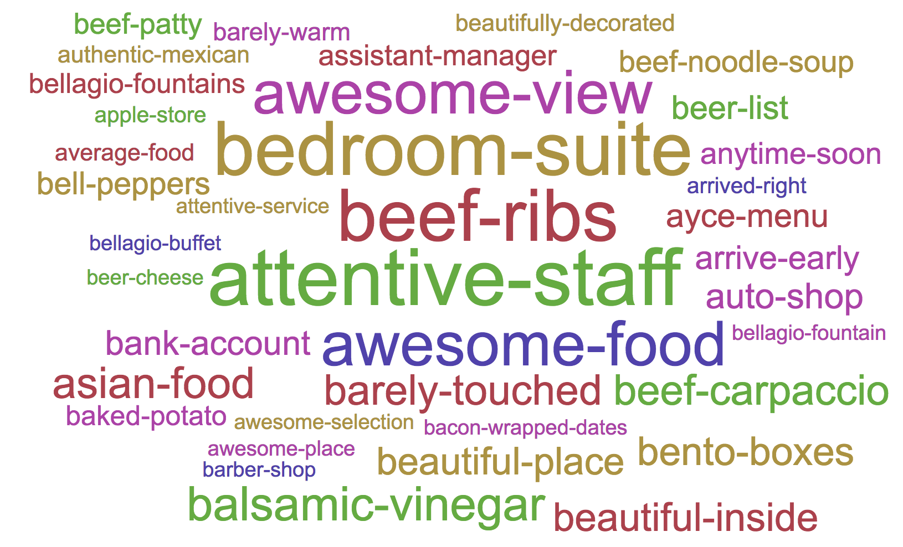

# Phrase-At-Scale

`Phrase-At-Scale` provides a fast and easy way to discover phrases from large text corpora using PySpark. Here's an example of phrases extracted from a review dataset:

<div align="center" width="100%">

</div>

## Features
- Discover most common phrases in your text
- Size of discovered phrases can be arbitrary (typically: bigrams and trigrams)
- Adjust configuration to control quality of phrases
- Can be used in languages other than English 
- Can be run locally using multiple threads, or in parallel on multiple machines
- Annotate your corpora with the phrases discovered

## Quick Start

## Run locally
To re-run phrase discovery using the default dataset:
1. Install [Spark](https://spark.apache.org/downloads.html) 
2. Clone this repo and move into its top-level directory.

	```
	git clone git@github.com:kavgan/phrase-at-scale.git
	```
3. Run the spark job: 
	```
	<your_path_to_spark>/bin/spark-submit --master local[200] --driver-memory 4G phrase_generator.py 
	``` 
  This will use settings (including input data files) as specified in `config.py`.

4. You should be able to monitor the progress of your job at [http://localhost:4040/](http://localhost:4040/)

**Notes:**

- The above command runs the job on master and uses the specified number of threads within `local[num_of_threads]`.
- This job outputs 2 files: 
	1. the list of phrases under `top-opinrank-phrases.txt` 
	1. the annotated corpora under `data/tagged-data/` 


## Configuration
To change configuration, just edit the [config.py](config.py) file.

| Config  |  Description |
|---|---|
|`input_file`   |Path to your input data files. This can be a file or folder with files. The default assumption is one text document (of any size) per line. This can be one sentence per line, one paragraph per line, etc. |
| `output-folder`  | Path to output your annotated corpora. Can be local path or on HDFS   |
| `phrase-file`  |Path to file that should hold the list of discovered phrases.    |
| `stop-file`  | Stop-words file to use to indicate phrase boundary.   |
| `min-phrase-count`  | Minimum number of occurrence for phrases. Guidelines: use 50 for < 300 MB of text, 100 for < 2GB and larger values for a much larger dataset.  |


## Dataset

The default configuration uses a subset of the [OpinRank](http://kavita-ganesan.com/entity-ranking-data/#.WtrU49Pwads) dataset, consisting of about 255,000 hotel reviews. You can use the following to cite the dataset:

```
@article{ganesan2012opinion,
  title={Opinion-based entity ranking},
  author={Ganesan, Kavita and Zhai, ChengXiang},
  journal={Information retrieval},
  volume={15},
  number={2},
  pages={116--150},
  year={2012},
  publisher={Springer} 
}
```

## Contact
This repository is maintained by [Kavita Ganesan](mailto:ganesan.kavita@gmail.com). Please send me an e-mail or open a GitHub issue if you have questions. 
